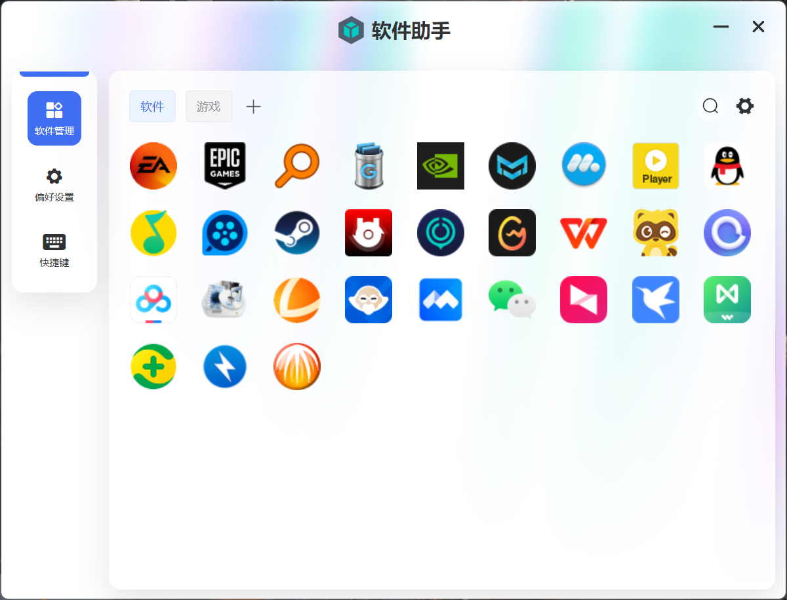
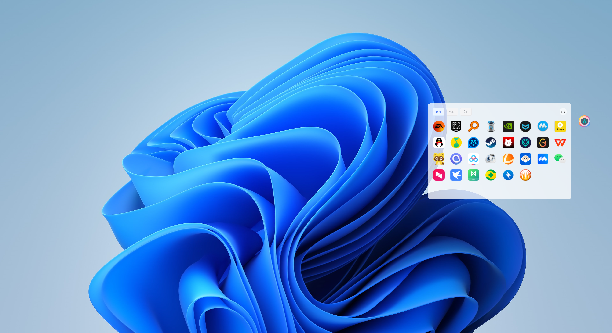

# software-box

🥳 Really simple `Electron` + `Vue` + `Vite` Software assistant.

software-box是一款简单易用的桌面端软件管理工具，支持鼠标拖曳方式来自定义添加程序或是资料夹。可以使桌面更加整洁，轻松管理你的软件。添加悬浮球，即使在全屏程序下也能快速打开软件而无需返回桌面。





## Quick Setup

```sh
# clone the project
git clone https://github.com/Feng-ML/software-box.git

# enter the project directory
cd software-box

# install dependency
npm install

# develop
npm run dev
```

## Directory

```diff
+ ├─┬ electron
+ │ ├─┬ main
+ │ │ └── index.ts    entry of Electron-Main
+ │ └─┬ preload
+ │   └── index.ts    entry of Preload-Scripts
  ├─┬ src
  │ └── main.ts       entry of Electron-Renderer
  ├── index.html
  ├── package.json
  └── vite.config.ts
```
