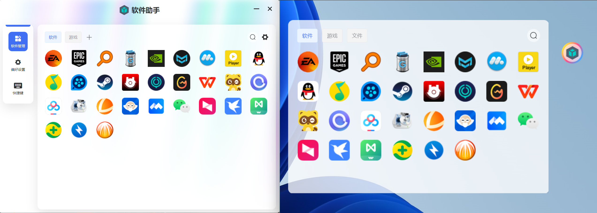

<p align="center">
  
</p>
<h1 align="center">software-box</h1>

<p align="center">
  A Really simple <b>Electron</b> + <b>Vue3</b> + <b>TypeScript</b> + <b>Vite</b> Software assistant.
</p>

<p align="center">
  <a href="https://github.com/Feng-ML/software-box/releases/latest">
    
  </a>
</p>

## Introduction

software-box是一款简单易用的桌面端软件管理工具，支持鼠标拖曳方式来自定义添加程序或是资料夹。可以使桌面更加整洁，轻松管理你的软件。添加悬浮球，即使在全屏程序下也能快速打开软件而无需返回桌面。



## Features

- 🔗支持添加所有文件格式
- 🕹️允许鼠标拖曳批量添加
- 🎈自定义悬浮球
- 🎨主题切换
- 🤖丰富的自定义配置
- 🔑全局快捷键绑定

## Quick Setup

Requirements:

- `node` >= 18.19

```sh
# clone the project
git clone https://github.com/Feng-ML/software-box.git

# enter the project directory
cd software-box

# install dependency
npm install

# develop
npm run dev
```

## Directory

```diff
+ ├─┬ electron
+ │ ├─┬ main
+ │ │ └── index.ts    entry of Electron-Main
+ │ └─┬ preload
+ │   └── index.ts    entry of Preload-Scripts
  ├─┬ src
  │ └── main.ts       entry of Electron-Renderer
  ├── index.html
  ├── package.json
  └── vite.config.ts
```
